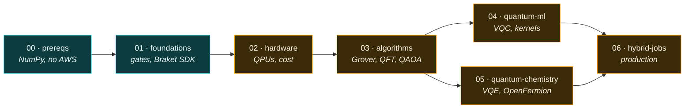
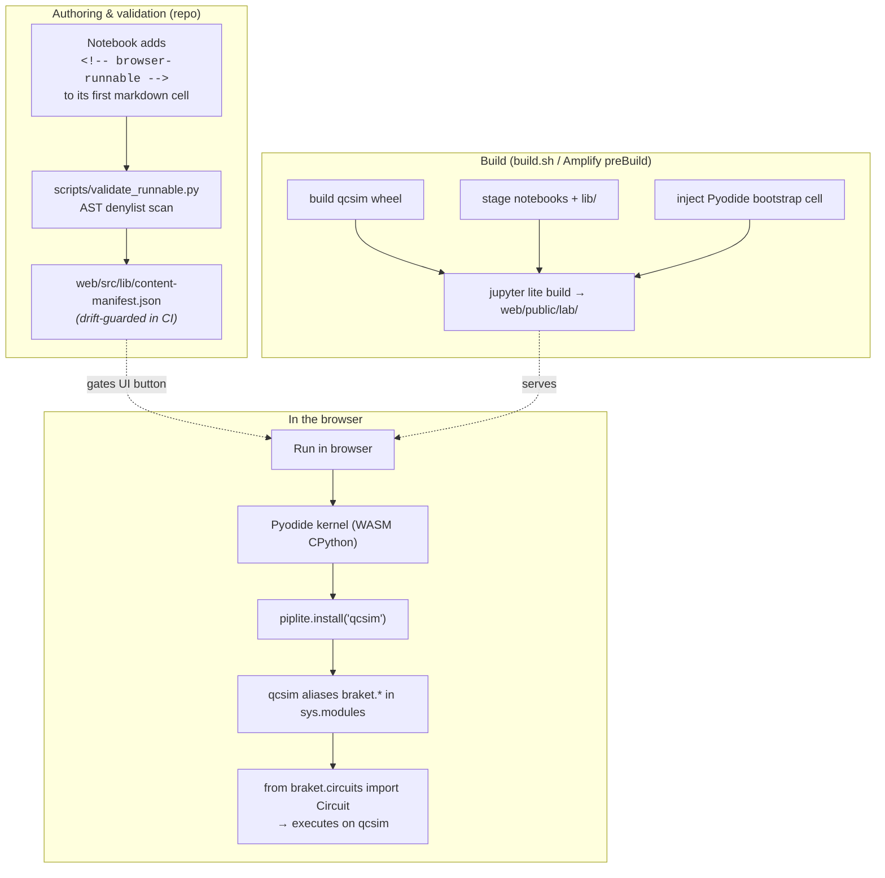
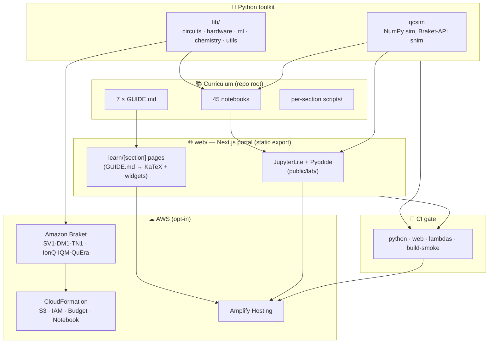
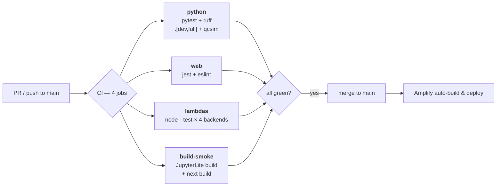
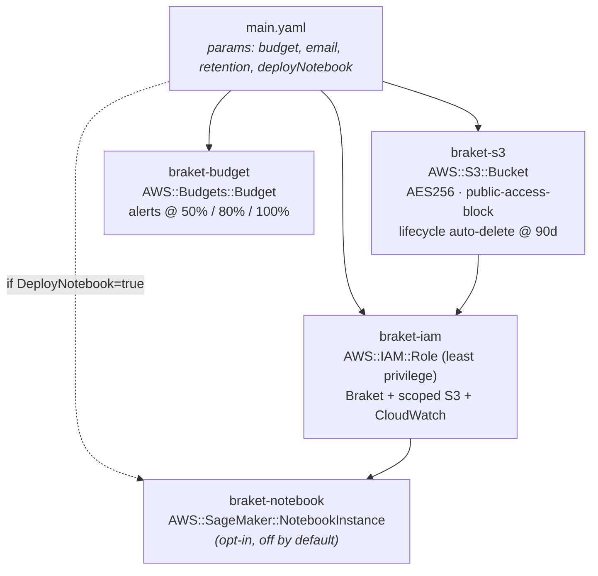

<div align="center">

# Quantum Computing Workspace

### A zero-to-production learning path for quantum computing on Amazon Braket — with a math-native web portal and notebooks that run in your browser.

**The Braket-native learning platform where the code you write runs _unmodified_ — free in your browser, or on a real 20-qubit QPU — sponsored, so a learner never pays.**

[](https://github.com/AltivumInc-Admin/quantum-computing/actions/workflows/ci.yml)
[](pyproject.toml)
[](web/package.json)
[](web)
[](https://aws.amazon.com/braket/)
[](#-run-notebooks-in-your-browser-jupyterlite--qcsim)

**[Learning path](#-the-learning-path) · [Quick start](#-quick-start) · [In-browser notebooks](#-run-notebooks-in-your-browser-jupyterlite--qcsim) · [Architecture](#-architecture) · [Commands](#-command-reference) · [Cost awareness](#-cost-awareness)**

</div>

---

## What is this?

A single repository that teaches quantum computing **from "I've never seen a complex number in code" to "I run production hybrid quantum-classical jobs on real QPUs"** — and ships the tooling to make every step real:

- **A 7-module, 45-notebook curriculum** on [Amazon Braket](https://aws.amazon.com/braket/), strictly numbered and cumulative, with cost-awareness woven through every step.
- **A statically-exported Next.js learning portal** (`web/`) that renders each module's `GUIDE.md` as a math-native page with **live, interactive circuit widgets** and an **interactive placement quiz**.
- **In-browser, zero-install notebooks**: 32 of the 45 notebooks run entirely in your browser via **JupyterLite + Pyodide**, with a custom NumPy simulator (`qcsim`) that drop-in replaces the Braket SDK.
- **A shared Python toolkit** (`lib/`) of circuits, device abstractions, QML, and quantum-chemistry building blocks the notebooks import instead of reinventing.
- **Production AWS infrastructure as code** (`infra/`) — least-privilege IAM, encrypted result storage with lifecycle cleanup, and a hard monthly budget alarm.
- **Four serverless backends** (`lambda/`) — the streaming lesson tutor (Bedrock), per-user progress sync, the hard-capped real-QPU submission path, and an opt-in review-email sender — each an independently tested Node.js Lambda with its own SAM template.
- **A CI gate and an auto-deploy pipeline** so `main` is always green and the live site is always built from a passing commit.

> **Philosophy:** prototype on the **free local simulator** first, validate, then spend. Real QPU/managed-simulator runs are always opt-in and cost-estimated before execution. (On quantum.altivum.ai the platform pays for QPU runs; in this repo, running against your own AWS account bills you.)

---

## Highlights

| | |
|---|---|
| **Truly beginner-first** | `00-prereqs` assumes *no* quantum background and *no* AWS account — just NumPy. Every formal symbol is taught **Plain English → Code first → Notation → Self-check**, with a Dirac↔NumPy "Rosetta stone." |
| **Notebooks that run anywhere** | 32 notebooks execute in the browser with no install (Pyodide + `qcsim`). The rest run locally on the free Braket `LocalSimulator`. |
| **Math-native portal** | KaTeX everywhere, plus `​```qsim` fenced blocks that become **live circuit simulators** (probability bars, Dirac state, Bloch dial, θ slider) right inside the prose. |
| **Simulator parity, proven** | `qcsim` (Python) and `math.ts` (TypeScript) both mirror Braket's conventions and are **tested for parity** against the real SDK to 4σ / `1e-10`. |
| **Cost-safe by construction** | Per-provider cost estimators, a `make cost` Cost-Explorer report, and a CloudFormation **budget alarm** at 50 % / 80 % / 100 %. |
| **Real engineering rigor** | 4-job CI (Python + web + Lambda backends + build-smoke), protected `main` with required checks, a "runnable-notebook contract" that statically *and* dynamically proves browser-runnability, `nbstripout` clean diffs, and `ruff`. |

---

## 🧭 Who this is for

A **beginner-friendly on-ramp for the self-directed learner who intends to actually _run_ quantum hardware** — not just read about it. Start with no quantum background and no AWS account; the platform is built to carry you the whole way.

The path has three rungs — **Newcomer → Practitioner → Subject-matter expert.** Most platforms stop at "completed the course." Here, mastery is legible and *earned*, and the learners who reach the top rung help shape what the platform teaches next.

- **North-Star — the number we steer on:** _mastery gained_ — skills a learner moves into proven, spaced-repetition-verified retention each week. It rises only with genuine advancement and cannot be crammed.
- **The destination it points to:** learners who reach practitioner grade, run real circuits on actual QPUs, and go on to shape the platform as subject-matter experts.

---

## Table of contents

- [Who this is for](#-who-this-is-for)
- [The learning path](#-the-learning-path)
- [Quick start](#-quick-start)
- [Run notebooks in your browser](#-run-notebooks-in-your-browser-jupyterlite--qcsim)
- [Architecture](#-architecture)
- [Repository layout](#-repository-layout)
- [The `lib/` toolkit](#-the-lib-toolkit)
- [`qcsim` — the in-browser simulator](#-qcsim--the-in-browser-simulator)
- [The web portal](#-the-web-portal)
- [The serverless backends](#-the-serverless-backends-lambda)
- [Command reference](#-command-reference)
- [Testing & CI](#-testing--ci)
- [AWS infrastructure & cost controls](#-aws-infrastructure--cost-controls)
- [Cost awareness](#-cost-awareness)
- [Deployment](#-deployment)
- [Contributing](#-contributing)
- [Tech stack](#-tech-stack)
- [License](#-license)

---

## 🎓 The learning path

The curriculum is **strictly numbered and cumulative.** Each module's GUIDE names the exact prior modules it requires; setup ramps from `pip install numpy` (prereqs) → `make setup` (hardware) → `make deploy-infra` (hybrid jobs).



<sub>🟦 Teal = runs free (local sim / browser). 🟧 Amber = needs AWS credentials.</sub>

| # | Module | Notebooks | In-browser | Focus |
|---|--------|:---------:|:----------:|-------|
| **00** | **Prerequisites: From Zero to Ready-for-Quantum** | 6 | **6/6** | NumPy linear algebra, probability & the Born rule, Dirac notation, the Bloch sphere — **no AWS** |
| **01** | **Quantum Computing Foundations** | 5 | **5/5** | Qubits, the full single/multi-qubit gate set, entanglement (Bell/GHZ), measurement, the Braket circuit model |
| **02** | **Quantum Hardware on Amazon Braket** | 6 | **4/6** | IonQ / IQM / QuEra QPUs, SV1 / DM1 / TN1 managed simulators, noise, device selection & cost estimation |
| **03** | **Quantum Algorithms** | 6 | **6/6** | Deutsch-Jozsa, Grover, QFT, Quantum Phase Estimation, QAOA (MaxCut), amplitude estimation |
| **04** | **Quantum Machine Learning** | 7 | **5/7** | Data encodings, variational classifiers, quantum kernels, barren plateaus, PennyLane + Braket |
| **05** | **Quantum Chemistry & Biochemistry** | 8 | **6/8** | Molecular Hamiltonians, fermion→qubit mappings, VQE/SSVQE, ansatz design, active spaces |
| **06** | **Production Hybrid Quantum-Classical Jobs** | 7 | 0/7 | Braket Hybrid Jobs, parametric compilation, checkpointing, custom containers, monitoring & cost controls |
| | **Total** | **45** | **32** | |

Each module's `GUIDE.md` follows the same shape: **Learning Objectives → Prerequisites → Concepts → Hands-On Exercises (numbered notebooks, each with a Scripts subsection) → References.** Reusable helper scripts (`scripts/`) keep shared logic out of the lessons. `00-prereqs` is the exception — it adds a Setup section and a Self-Assessment, and ends with a **10-question placement quiz** (rendered interactively in the portal): pass ≥ 7 unaided and skip straight to `01-foundations`.

---

## 🚀 Quick start

Pick the on-ramp that matches how far you want to go. **None of the first two require an AWS account.**

### Path A — Just learn (browser only, zero install)

Open the deployed portal, read a module, and click **Run in browser** on any notebook badged **Pyodide**. Nothing to install — the notebook executes in a WebAssembly Python kernel with `qcsim` standing in for Braket.

> Running the portal locally? See [The web portal](#-the-web-portal).

### Path B — Local notebooks (free simulator, no AWS)

```bash
# Python 3.10+ recommended (CI pins 3.12)
git clone https://github.com/AltivumInc-Admin/quantum-computing.git
cd quantum-computing

python -m venv .venv && source .venv/bin/activate   # Windows: .venv\Scripts\activate

# Minimal: just NumPy/Matplotlib/Jupyter for the prereqs module
pip install numpy matplotlib jupyterlab ipywidgets
python 00-prereqs/scripts/check_prereqs.py          # verifies your environment

jupyter lab 00-prereqs/notebooks                    # start learning
```

Everything in `00-prereqs`, `01-foundations`, and the first three `03-algorithms` notebooks runs on the **free local simulator** — no AWS credentials needed.

### Path C — Full workspace (AWS Braket, real hardware)

```bash
git clone https://github.com/AltivumInc-Admin/quantum-computing.git
cd quantum-computing
python -m venv .venv && source .venv/bin/activate

make setup            # installs .[dev] + qcsim, validates AWS creds, installs nbstripout
make devices          # list available Braket devices + status
make lab              # launch JupyterLab at the repo root

# Optional: provision encrypted result storage, least-privilege IAM, and a budget alarm
make deploy-infra     # interactive: budget, notification email, optional managed notebook
make cost             # current month's Braket spend (Cost Explorer)
```

Configure AWS via `~/.aws` and the variables in [`.env.example`](.env.example) (region, S3 bucket/prefix, monthly budget). `make setup` runs [`infra/scripts/validate-setup.sh`](infra/scripts/validate-setup.sh), which checks the AWS CLI, credentials, Braket-supported region, and the Braket SDK.

---

## 🌐 Run notebooks in your browser (JupyterLite + qcsim)

The headline feature: **32 notebooks run with zero install**, directly in the browser. The site is a fully static export, and every circuit, simulator, and grader executes client-side on a WebAssembly Python kernel — the only servers involved are the four small [serverless backends](#-the-serverless-backends-lambda) powering optional, env-gated features (tutor, progress sync, QPU submission, review email). The learning core needs nothing but a browser tab.

### How it works

The real `amazon-braket-sdk` cannot be installed inside Pyodide. So this repo ships **[`qcsim`](qcsim/)** — a compact, pure-NumPy state-vector simulator that **registers itself in `sys.modules` as `braket`, `braket.circuits`, and `braket.devices`**. That means a notebook's `from braket.circuits import Circuit` runs **unmodified** in the browser.



### The runnable-notebook contract

A notebook is only offered as runnable if it **provably** works under Pyodide. This is enforced at four layers:

1. **Opt-in marker** — the author adds `<!-- browser-runnable -->` to the notebook's first markdown cell. The marker is read at build time by [`scripts/validate_runnable.py`](scripts/validate_runnable.py) (`is_marked_runnable`), never at runtime: the portal reads the scan RESULT, not the notebook.
2. **Static AST scan** — [`scripts/validate_runnable.py`](scripts/validate_runnable.py) walks each marked notebook's code and **rejects** anything `qcsim` can't satisfy: imports outside `{braket, braket.circuits, braket.devices}`, denied packages (`pennylane`, `openfermion`, `pyscf`, `boto3`, `qiskit`, `cirq`, …), real-SDK names (`AwsDevice`, `AwsQuantumJob`, …), and unsupported result-type calls (`.probability`, `.expectation`, …).
3. **Live execution + drift guard** — [`tests/test_notebook_contract.py`](tests/test_notebook_contract.py) actually **runs** every marked notebook end-to-end under `qcsim` (via `nbclient`), and asserts the committed `content-manifest.json` matches exactly what a fresh scan would produce — so the homepage list can never silently drift.
4. **The web gate** — the scan result is baked into [`web/src/lib/content-manifest.json`](web/src/lib/content-manifest.json) as a per-notebook `runnable` boolean, and [`manifest.ts`](web/src/lib/manifest.ts)'s `isNotebookRunnable` is the single function that gates the button. `content.ts` and `workspace.ts` both consume it, so the UI can only ever offer what CI validated.

### Parity, proven both ways

`qcsim` is held to the **real Braket SDK** by [`tests/test_qcsim_parity.py`](tests/test_qcsim_parity.py): 10 reference circuits (Bell, GHZ, Deutsch-Jozsa, single-iteration Grover, adjoint-identity, …) must match Braket's measurement distributions **within 4σ at 1000 shots**, with exact equality on deterministic outcomes — plus exact state-vector, norm-preservation, and `adjoint()` correctness checks. The portal's TypeScript kernel ([`web/src/components/quantum/math.ts`](web/src/components/quantum/math.ts)) is independently checked against committed `qcsim` gate fixtures to **`1e-10`**, so the browser circuit widgets and the Python simulator never disagree.

---

## 🏛 Architecture

This is a **dual-stack monorepo**: a Python curriculum/toolkit and a TypeScript learning portal, joined by `qcsim` (which runs in both worlds) and shipped as a single static site.



**Two simulators, one source of truth.** The Python `qcsim` and the TypeScript `math.ts` both follow Braket's **big-endian** convention (qubit 0 is the most-significant bit) and are kept in lockstep by tests, so a circuit behaves identically whether it runs in a notebook, in the browser kernel, or in a `qsim` widget on a GUIDE page.

---

## 🗂 Repository layout

```text
quantum-computing/
├── 00-prereqs/              # NumPy on-ramp — no AWS, no quantum SDK (6 notebooks)
├── 01-foundations/          # Qubits, gates, entanglement, Braket basics (5)
├── 02-hardware/             # QPUs, managed simulators, noise, cost (6)
├── 03-algorithms/           # Deutsch-Jozsa, Grover, QFT, QPE, QAOA (6)
├── 04-quantum-ml/           # Encodings, VQCs, kernels, barren plateaus (7)
├── 05-quantum-chemistry/    # Hamiltonians, VQE/SSVQE, active spaces (8)
├── 06-hybrid-jobs/          # Production Braket Hybrid Jobs (7)
│   ├── algorithms/          #   qaoa_maxcut_job.py · vqe_chemistry_job.py · qml_training_job.py
│   └── containers/          #   Dockerfile + pip-tools requirements.{in,lock}
│       └─ each section also has  notebooks/  +  scripts/  +  GUIDE.md
│
├── lib/                     # Shared Python toolkit (the notebooks import this)
│   ├── circuits/            #   bell_pair, ghz_state, qft_circuit
│   ├── hardware/            #   get_device, run_circuit, DEVICE_ARNS
│   ├── ml/                  #   feature maps, VQC classifiers, training loop
│   ├── chemistry/           #   molecular Hamiltonians, VQE ansätze
│   └── utils/               #   result parsing, cost estimation, visualization
│
├── qcsim/                   # Pure-NumPy Braket-API simulator (runs in Pyodide)
│   ├── src/qcsim/           #   __init__.py · circuits.py · devices.py
│   └── API.md               #   simulator API + coverage notes
│
├── web/                     # Next.js 16 learning portal (static export)
│   ├── src/app/             #   layout, home, learn/[section] pages, globals.css
│   ├── src/components/      #   nav, sidebar, markdown-renderer, notebook-link, …
│   │   └── quantum/         #     circuit-lab (qsim widget), quiz, math.ts (TS sim)
│   ├── src/lib/             #   content.ts, sections.ts, manifest.ts, content-manifest.json
│   ├── jupyterlite-build/   #   build.sh → builds the in-browser lab into public/lab/
│   └── public/lab/          #   generated JupyterLite + Pyodide distribution
│
├── lambda/                  # Serverless backends — each is its own npm package + SAM template
│   ├── tutor/               #   "Ask the margin" lesson tutor: streaming Bedrock Lambda (see its README)
│   ├── sync/                #   versioned per-user progress KV behind a Cognito-authorized API
│   ├── qpu/                 #   hard-capped real-QPU submission path (see its README)
│   └── review-email/        #   opt-in spaced-repetition reminder sender (see its README)
│
├── infra/                   # AWS infrastructure as code
│   ├── cloudformation/      #   main + s3 + iam + budget + (optional) notebook
│   ├── scripts/             #   deploy / teardown / validate-setup / cost-report
│   ├── workspace/           #   Cognito user pool for the Workspace login
│   ├── redirect/            #   quantumlearner.dev → quantum.altivum.ai (CloudFront)
│   └── ci-standby/          #   CodeBuild warm-standby CI mirror + failover script
│
├── tests/                   # pytest suite (lib + qcsim parity + notebook contract + content guards)
├── scripts/                 # validate_runnable.py · fixture generators · web build helpers
├── docs/                    # design specs & implementation plans
├── Makefile                 # setup · lab · test · devices · cost · lint · deploy-infra …
├── pyproject.toml           # deps (core / dev / full extras), ruff, pytest config
├── amplify.yml              # AWS Amplify build pipeline
└── .github/workflows/ci.yml # python · web · lambdas · build-smoke
```

---

## 🧰 The `lib/` toolkit

`lib/` is the workspace's simulator-first toolkit — notebooks compose building blocks from it instead of re-implementing primitives. Imports are subpackage-qualified (`from lib.circuits import bell_pair`).

<details open>
<summary><b><code>lib.circuits</code></b> — reusable circuit patterns</summary>

| Function | Description |
|---|---|
| `bell_pair(qubit_0=0, qubit_1=1)` | Maximally-entangled pair `(\|00⟩+\|11⟩)/√2` via H + CNOT |
| `ghz_state(n_qubits=3)` | n-qubit GHZ state via H + a CNOT chain |
| `qft_circuit(n_qubits)` | Quantum Fourier Transform (H + controlled phases + reversal SWAPs) |
</details>

<details>
<summary><b><code>lib.hardware</code></b> — run on any Braket backend</summary>

| Symbol | Description |
|---|---|
| `get_device(name="local")` | `LocalSimulator` for `"local"`, else `AwsDevice`; raises on unknown names |
| `run_circuit(circuit, device_name="local", shots=1000, s3_location=None)` | Run and return results; **fails fast** if a non-local device is missing `s3_location` (so CI needs no credentials) |
| `list_available_devices()` | Live device list with status (needs AWS) |
| `DEVICE_ARNS` | `dict` of short names → ARNs: `sv1, dm1, tn1, ionq_forte, iqm_garnet, quera_aquila` |
</details>

<details>
<summary><b><code>lib.ml</code></b> — quantum machine learning</summary>

| Symbol | Description |
|---|---|
| `angle_encoding`, `amplitude_encoding`, `iqp_encoding` | Feature maps (Ry angles · Möttönen amplitudes · IQP) → Braket `Circuit` |
| `build_vqc_circuit(...)` | Variational quantum classifier: angle encoding + Ry/CNOT layers |
| `quantum_kernel(x1, x2, feature_map_fn, shots=1000)` | `K = \|⟨φ(x1)\|φ(x2)⟩\|²` via the compute–uncompute trick |
| `vqc_qnode(...)` | Differentiable **PennyLane** `QNode` of the VQC (analytic gradients) |
| `train_vqc(X_train, y_train, ...)` | Hybrid training loop (PennyLane gradient descent); returns optimal params + loss/accuracy history |
</details>

<details>
<summary><b><code>lib.chemistry</code></b> — quantum chemistry (VQE)</summary>

| Symbol | Description |
|---|---|
| `build_h2_hamiltonian(bond_length=0.735)` | H₂ Jordan-Wigner qubit Hamiltonian (STO-3G via PySCF) → `(H, n_qubits, n_electrons)` |
| `build_lih_hamiltonian(bond_length=1.546)` | Same for LiH |
| `hamiltonian_info(H)` | Inspect an OpenFermion `QubitOperator` (terms, locality, identity coeff) |
| `hardware_efficient_ansatz(...)`, `uccsd_singles_circuit(...)` | Parameterized VQE ansätze → Braket `Circuit` |
</details>

<details>
<summary><b><code>lib.utils</code></b> — results, cost, visualization</summary>

| Symbol | Description |
|---|---|
| `parse_counts(result)` · `top_results(counts, n=5)` · `expectation_from_counts(counts, fn)` | Result parsing & expectation values |
| `lib.utils.cost`: `estimate_cost(...)`, `format_cost_warning(...)`, `PRICING` | Per-provider cost math (imported by full module path) |
| `lib.utils.visualization`: `plot_histogram(...)`, `plot_bloch_angles(...)` | Matplotlib figures (imported by full module path) |

> Note: `lib.utils.__init__` re-exports only the `results` helpers; `cost` and `visualization` are reached via their full module paths.
</details>

---

## ⚛ `qcsim` — the in-browser simulator

[`qcsim`](qcsim/) is a **separate, pure-NumPy package** (`numpy` is its only dependency) that mirrors *exactly the subset* of the Braket SDK the curriculum uses — so notebooks run unmodified in Pyodide. See [`qcsim/API.md`](qcsim/API.md).

```python
from braket.circuits import Circuit       # resolves to qcsim in the browser
from braket.devices import LocalSimulator

circuit = Circuit().h(0).cnot(0, 1)
result  = LocalSimulator().run(circuit, shots=1000).result()
result.measurement_counts                 # Counter({"00": ~500, "11": ~500})
```

| Area | Coverage |
|---|---|
| **Gates** | `h x y z s t i`, `rx ry rz`, `cnot cz cphaseshift swap`, `ccnot` (Toffoli) — up to 3-qubit gates |
| **Circuit** | chaining, `.add_circuit()`, `.adjoint()`, `.instructions`, `.qubit_count`, `.depth`, ASCII `str()`. (`.state_vector()` exists but DIVERGES from the real SDK — notebooks read amplitudes via the portable `lib.utils.statevector.statevector(circuit)` helper instead; see `qcsim/API.md`.) |
| **Execution** | `LocalSimulator().run(circuit, shots)` → `.result()` with `.measurement_counts`, `.measurements`, `.measurement_probabilities` |
| **Braket parallels** | `qcsim.Circuit ↔ braket.circuits.Circuit`, `qcsim.LocalSimulator ↔ braket.devices.LocalSimulator`, result types mirror `GateModelQuantumTaskResult` |
| **Intentionally *not* covered** | `braket.aws` / real hardware, noise channels, mid-circuit measurement, managed simulators, `.expectation()`/`.probability()` result types |

Notebooks that import `braket.aws` **must not** be marked browser-runnable — the [runnable contract](#the-runnable-notebook-contract) enforces this automatically.

---

## 💻 The web portal

`web/` is a **Next.js 16 + React 19** app, **statically exported** (`output: "export"`) — no server, no API routes. It turns each `GUIDE.md` into an interactive page and bundles the JupyterLite lab as static assets.

**Stack:** Next.js 16 · React 19 · Tailwind CSS v4 (configured entirely in `globals.css` via `@theme`/`@plugin`/`@variant`, no `tailwind.config`) · `next-themes` (dark default) · `react-markdown` + `remark-gfm`/`remark-math` + `rehype-katex`/`rehype-highlight` · KaTeX · fonts **Instrument Serif** (display) + **Plus Jakarta Sans** (body).

**Content pipeline.** [`web/src/lib/sections.ts`](web/src/lib/sections.ts) is the 7-entry section manifest; [`content.ts`](web/src/lib/content.ts) reads each sibling `GUIDE.md` at build time and lists its notebooks (detecting the `<!-- browser-runnable -->` marker). `learn/[section]/page.tsx` is statically materialized via `generateStaticParams()`.

**Two interactive Markdown extensions** (wired in [`markdown-renderer.tsx`](web/src/components/markdown-renderer.tsx) by overriding the `pre` renderer):

- ` ```qsim ` → **`CircuitLab`** — a live simulator from a tiny gate DSL (`H 0`, `CNOT 0 1`, `RY 0 theta`). Renders probability bars, the Dirac-notation state, a single-qubit Bloch dial, and a θ slider for slider-bound rotations.
- ` ```quiz ` → **`Quiz`** — an interactive quiz from a JSON block (`{ questions: [{ q, hint?, a }] }`) with per-question hint/answer disclosures and a "show all" toggle.

**Design system.** A token-driven system in `globals.css`: a cascading surface scale (`--surface-*`), two-step elevation shadows, a radius scale (`--radius-chip/-control/-card`), an OKLCH accent (cyan) + warm (amber) palette, fluid `clamp()` typography with `text-wrap: balance`, per-section hues, and comprehensive `prefers-reduced-motion` coverage. Accessibility is first-class (focus-visible rings everywhere, `aria-*` on every interactive control, reduced-motion, decorative SVG hidden from AT).

**Quality:** a **170+-suite Jest test bed** (components, content pipeline, contrast/accessibility guards, and the `math.ts`↔`qcsim` gate-fixture parity), plus a Playwright e2e smoke that boots real Pyodide in the built lab (`npm run test:e2e`, needs `npm run build` first — see [`web/e2e/README.md`](web/e2e/README.md)).

```bash
cd web
npm install
npm run dev      # http://localhost:3000
npm test         # Jest unit suite
npm run build    # static export → web/out/
```

---

## 🔌 The serverless backends (`lambda/`)

The static site is backed by four small, independently deployed Node.js Lambdas — each a self-contained npm package with its own SAM `template.yaml`, tests that stub AWS, and (where noted) a README with deploy and ops details:

| Backend | What it does | Docs |
|---|---|---|
| [`lambda/tutor/`](lambda/tutor/) | "Ask the margin" — a stateless, response-streaming lesson tutor grounded in the current lesson via Amazon Bedrock | [`README`](lambda/tutor/README.md) |
| [`lambda/sync/`](lambda/sync/) | Versioned per-user KV for progress snapshots with optimistic concurrency; identity from the API's Cognito JWT authorizer | header comment in [`index.mjs`](lambda/sync/index.mjs) |
| [`lambda/qpu/`](lambda/qpu/) | The hard-capped, server-side path by which a learner runs a circuit on real QPU hardware | [`README`](lambda/qpu/README.md) |
| [`lambda/review-email/`](lambda/review-email/) | Scheduled sender that emails only opted-in learners with spaced-repetition cards actually due, with tokenized unsubscribe | [`README`](lambda/review-email/README.md) |

Local dev loop for any of them:

```bash
cd lambda/<tutor|sync|qpu|review-email>
npm ci
npm test        # node --test, offline (AWS clients stubbed)
```

The portal treats these as optional: front-end features gate on their configuration (e.g. the tutor affordance stays hidden until `NEXT_PUBLIC_TUTOR_URL` is set), so the static export builds and deploys cleanly without any of them.

---

## 📋 Command reference

### Make targets (repo root)

| Command | What it does |
|---|---|
| `make setup` | `pip install -e .[dev]` + `pip install -e ./qcsim`, validate AWS creds, install the `nbstripout` git filter |
| `make lab` | Launch JupyterLab at the repo root (`jupyter lab --notebook-dir=.`) |
| `make test` | Run the pytest suite (`pytest tests/ -v`) |
| `make devices` | Print available Braket devices + status, provider, qubit count |
| `make cost` | Current month's Braket spend via Cost Explorer (`infra/scripts/cost-report.py`) |
| `make lint` | `ruff check .` **and** `ruff format --check .` |
| `make deploy-infra` | Interactive CloudFormation deploy (budget, email, optional notebook) |
| `make teardown-infra` | Delete the stack (guarded — type `delete` to confirm) |
| `make lock-container` | Recompile the hybrid-jobs container lockfile with `pip-compile` |

### Web (`cd web`)

| Command | What it does |
|---|---|
| `npm run dev` | Dev server on port 3000 |
| `npm run build` | Static export to `web/out/` |
| `npm test` | Jest unit suite |
| `npm run test:e2e` | Playwright in-browser smoke (run `npm run build` first) |
| `npm run lint` | ESLint |

### Lambda backends (`cd lambda/<name>`)

| Command | What it does |
|---|---|
| `npm ci` | Install that backend's pinned dependencies |
| `npm test` | Offline handler tests (`node --test`, AWS clients stubbed) |

> **Dependency extras:** core install gives you Braket + NumPy/SciPy/Matplotlib. `.[dev]` adds pytest/ruff/nbstripout + the notebook-contract runtime. `.[full]` adds **PennyLane**, **OpenFermion/PySCF**, and JupyterLab — required for modules 04–05 and for CI to not silently skip those tests.

---

## ✅ Testing & CI

Every PR and every push to `main` runs four jobs ([`ci.yml`](.github/workflows/ci.yml)); `main` is a **protected branch** with required status checks, so Amplify only ever builds a commit that already passed CI.



**Python test suite ([`tests/`](tests/)):** one pytest module per concern, covering the `lib/` toolkit (circuits, devices, cost math, results, visualization), QML and chemistry (gated on the PennyLane / OpenFermion extras), and the platform's own guarantees — `test_qcsim_parity.py` (**`qcsim` vs the real Braket SDK** to 4σ, plus exact state-vector / norm / adjoint checks), `test_notebook_contract.py` (static AST scan + manifest drift guard + **live execution** of every runnable notebook), and content guards (notebook links, pricing prose, the `00-prereqs` invariants). Browse `tests/` for the full, current list.

Pinning: **Python 3.12** (matches the Amplify image; `pyscf`/`openfermionpyscf` wheels exist for 3.12), **Node 20**. Run the fast subset locally with `pytest -m "not slow"`.

---

## ☁ AWS infrastructure & cost controls

`make deploy-infra` provisions a nested CloudFormation stack ([`infra/cloudformation/`](infra/cloudformation/)) — least-privilege, encrypted, and budget-guarded by default.



- **S3** — encrypted (AES256) results bucket, all public access blocked, **lifecycle rule auto-deletes results after `ResultsRetentionDays` (default 90)** to bound storage spend.
- **IAM** — a single role scoped to Braket task/job actions, `s3:{Put,Get,List}` on the results bucket only, and CloudWatch logging under `/aws/braket/*`.
- **Budget** — a monthly **Amazon Braket–scoped** budget that emails you at **50 % / 80 % actual** and **100 % forecasted**.
- **Notebook** — an optional SageMaker managed notebook, **off by default** (the always-on instance is never provisioned unless you pass `DeployNotebook=true`).

> ⚠️ The nested stacks reference local `TemplateURL` paths; deploying with nested templates from S3 may require an `aws cloudformation package` step. The default deploy path works for a single-file flow — review before production use.

---

## 💸 Cost awareness

**Always prototype on the free local simulator, then escalate only when validated.** Helper utilities (`lib.utils.cost`, the per-section `cost_estimator.py`, and `make cost`) estimate spend before you submit.

| Backend | Price (approx., 2025) |
|---|---|
| **Local simulator** (`LocalSimulator`) | **Free** |
| SV1 / DM1 (managed) | $0.075 / minute |
| TN1 (tensor-network) | $0.275 / minute |
| IonQ (Forte 36q) | $0.30 / task + $0.08 / shot |
| IQM (Garnet 20q) | $0.30 / task + $0.00145 / shot |
| QuEra (Aquila 256q) | $0.30 / task + $0.01 / shot |
| Rigetti | $0.30 / task + $0.00035 / shot |

Recommended workflow: **local sim → SV1 for larger circuits → DM1/TN1 → QPU only once the algorithm is validated.** Check `make cost` regularly.

---

## 🚢 Deployment

The live portal is hosted on **AWS Amplify**, which auto-deploys `main` on every push using [`amplify.yml`](amplify.yml):

1. **preBuild** → `cd web/jupyterlite-build && bash build.sh` builds the qcsim wheel, stages notebooks + `lib/`, injects the Pyodide bootstrap, and runs `jupyter lite build` into `web/public/lab/`; then `npm ci`.
2. **build** → `npm run build` (Next.js static export). The pre-built JupyterLite lab is copied in as static assets.
3. **artifacts** → `web/out/`. The `.venv` and JupyterLite caches persist across builds.

Because `main` is protected by the CI gate, **only CI-green commits ever deploy.**

---

## 🤝 Contributing

1. **Branch from `main`** (it's protected — changes land via PR with CI green).
2. **`make setup`** then `make test` / `make lint`; for web changes, `cd web && npm test && npm run lint`.
3. **Notebooks** are committed **output-stripped** automatically via the `nbstripout` git filter (installed by `make setup`) — keep diffs clean.
4. **Making a notebook browser-runnable?** Add `<!-- browser-runnable -->` to its first markdown cell, ensure it imports only the qcsim-supported Braket surface, then run `python scripts/validate_runnable.py --write-manifest` and commit the updated `content-manifest.json`. CI will reject drift.
5. **Python** is `ruff`-formatted (line length 100, target py310); notebooks are excluded from linting and validated by `test_notebook_contract.py` instead.
6. **Contribute a Rep** — a graded exercise is one JSON file in [`content/reps/`](content/reps/); CI validates it with the same parsers and graders the live widgets use, and maintainers promote accepted Reps into the lessons. See [`content/reps/README.md`](content/reps/README.md).

Design specs and implementation plans live in [`docs/`](docs/).

---

## 🧱 Tech stack

| Layer | Technologies |
|---|---|
| **Quantum** | Amazon Braket SDK · `qcsim` (NumPy) · PennyLane · OpenFermion + PySCF |
| **Scientific Python** | NumPy · SciPy · Matplotlib · boto3 |
| **Notebooks** | JupyterLab · JupyterLite · Pyodide · nbclient · nbstripout |
| **Web** | Next.js 16 · React 19 · Tailwind CSS v4 · KaTeX · react-markdown · next-themes |
| **Cloud** | AWS Braket · Lambda · DynamoDB · Bedrock · Cognito · S3 · IAM · Budgets · SageMaker · CloudFormation · CloudFront · Amplify Hosting |
| **Tooling** | pytest · ruff · pip-tools · Jest · ESLint · GitHub Actions |

---

## 📄 License

This workspace is released under the **MIT License** — see [`LICENSE`](LICENSE). The bundled [`qcsim`](qcsim/) package is MIT-licensed as well.

---

<div align="center">
<sub>Built for learners going from first principles to production quantum workloads. Prototype free, validate, then spend.</sub>
</div>
